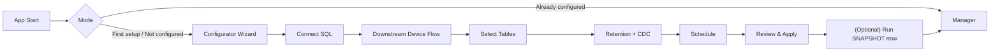

# UI Wireframes: Windows App (Configurator + Manager)

Цель: “плюс-минус” зафиксировать внешний вид и основные экраны Windows-приложения: первичный конфигуратор и менеджмент-консоль.

Принципы:
- Один десктопный app, два режима: `Configurator` (первичная настройка) и `Manager` (эксплуатация).
- Менеджер всегда работает через IPC (Named Pipes + JSON-RPC/StreamJsonRpc) и показывает онлайн-логи/статусы.
- Ошибки объясняются пользователю: “что сломано” + “что сделать”.

---

## 1) Информационная архитектура (экраны)

**Configurator (wizard)**
1) Welcome / Environment
2) Connect to SQL Server
3) Downstream Auth (OAuth Device Flow)
4) Discover & Select Tables
5) CDC & Retention Policy
6) Schedule
7) Review & Apply
8) Bootstrap Run (optional: start SNAPSHOT immediately)
9) Done

**Manager**
1) Dashboard (Service + Batch summary)
2) Runs (Batch list)
3) Run details (Tables + Datasets + Errors + Logs)
4) Tables (enabled/disabled, last LSN, lag, mode)
5) Diagnostics (prerequisites checks, permissions, SQL Agent, CDC jobs)
6) Settings (schedule, retention min, small-table threshold, endpoints)
7) Logs (live + export)



---

## 2) Wireframes (ASCII)

### 2.1 App Shell (общий каркас)

```
┌──────────────────────────────────────────────────────────────────────────────┐
│ SQL Server Data Extractor                                      [Min][Max][X] │
├──────────────────────────────────────────────────────────────────────────────┤
│  Mode:  [Configurator] [Manager]                                  Service: ● │
│  Connected: IPC ✓   SQL ✓   Downstream ✓                       Next run: 12:00│
├──────────────────────────────────────────────────────────────────────────────┤
│  Left nav (Manager)                 │  Main content                           │
│  - Dashboard                        │                                          │
│  - Runs                             │                                          │
│  - Tables                           │                                          │
│  - Diagnostics                      │                                          │
│  - Settings                         │                                          │
│  - Logs                             │                                          │
├──────────────────────────────────────────────────────────────────────────────┤
│ Status bar: Last event: ...                              Correlation: <id>    │
└──────────────────────────────────────────────────────────────────────────────┘
```

### 2.2 Configurator: Connect to SQL Server

```
┌──────────────────────────── Connect to SQL Server ───────────────────────────┐
│ Connection                                                                  │
│  Server:   [_____________]  Instance: [________]  Database: [_____________] │
│  Auth: (•) Windows/AD   ( ) SQL Login                                        │
│  User: [_____________]   Password: [********]   [ ] Encrypt (TLS)            │
│                                                                              │
│  [Test connection]  Result: ✅ OK / ❌ <error w/ hint>                        │
│                                                                              │
│ Prerequisites (read-only checks)                                             │
│  - SQL Agent: ✅ running / ❌ not running  [How to fix]                       │
│  - Permissions: ✅/❌ (cdc enable, select tables, view metadata)              │
│                                                                              │
│                               [Back] [Next]                                  │
└──────────────────────────────────────────────────────────────────────────────┘
```

### 2.3 Configurator: Downstream Auth (OAuth Device Flow)

```
┌──────────────────────────── Downstream Authorization ────────────────────────┐
│ Step 1: Get device code  [Request code]                                       │
│ Step 2: User action                                                          │
│  1) Open: https://<downstream>/device                                          │
│  2) Enter code:   ABCD-EFGH     [Copy]                                        │
│  3) Wait for confirmation...   Status: Pending / Authorized / Failed          │
│                                                                              │
│ Tokens                                                                       │
│  Access:  (hidden)                                                           │
│  Refresh: (stored via DPAPI)                                                  │
│                                                                              │
│                               [Back] [Next]                                  │
└──────────────────────────────────────────────────────────────────────────────┘
```

### 2.4 Configurator: Discover & Select Tables

```
┌──────────────────────────── Select Tables ───────────────────────────────────┐
│ Filter: [schema.table pattern__________]  [Search]  [Select all] [Clear]     │
│                                                                              │
│ ┌─ Table list ─────────────────────────────────────────────────────────────┐ │
│ │ [✓] schema | table       | CDC | Unique key | Est rows | Mode  | Notes   │ │
│ │ [✓] dbo    | Orders      | OK  | PK         |  12.3M   | CDC   |         │ │
│ │ [ ] dbo    | SmallDict   | NO  | none       |   420    | SNAP  | allowed │ │
│ │ [ ] dbo    | NoKeyBig    | NO  | none       |  3.1M    | BLOCK | add uniq│ │
│ └──────────────────────────────────────────────────────────────────────────┘ │
│                                                                              │
│ Details (for selected row)                                                   │
│  - Reason / Fix: “No unique index. Create unique index or mark as SNAP if <1000 rows.”│
│                                                                              │
│                               [Back] [Next]                                  │
└──────────────────────────────────────────────────────────────────────────────┘
```

### 2.5 Configurator: CDC & Retention Policy

```
┌──────────────────────────── CDC Policy ──────────────────────────────────────┐
│ CDC enablement                                                               │
│  [✓] Auto-enable CDC on database (if allowed)                                │
│  [✓] Auto-enable CDC on selected tables                                      │
│                                                                              │
│ Retention (minimum)                                                         │
│  Minimum retention: [ 7 ] days   (will not decrease if server has more)      │
│  Inactivity TTL for batch: [10] minutes                                      │
│                                                                              │
│ Small-table snapshot fallback                                                │
│  Enable SNAP fallback when no unique key and rows <= [1000]                  │
│                                                                              │
│                               [Back] [Next]                                  │
└──────────────────────────────────────────────────────────────────────────────┘
```

### 2.6 Configurator: Schedule

```
┌──────────────────────────── Schedule ────────────────────────────────────────┐
│ Default times (local server time)                                            │
│  [✓] 08:00   [✓] 12:00   [✓] 18:00   [+ Add] [- Remove]                      │
│                                                                              │
│ Concurrency                                                                  │
│  [✓] Prevent parallel runs (hard rule)                                       │
│                                                                              │
│                               [Back] [Next]                                  │
└──────────────────────────────────────────────────────────────────────────────┘
```

### 2.7 Configurator: Review & Apply

```
┌──────────────────────────── Review & Apply ──────────────────────────────────┐
│ Actions to apply                                                             │
│  - Enable CDC on DB: <db>                                                    │
│  - Enable CDC on 12 tables                                                   │
│  - Set retention min: 7 days                                                 │
│  - Save config + state store path                                             │
│                                                                              │
│ [Apply]   Progress: ███████░░░  70%                                          │
│                                                                              │
│ Results                                                                      │
│  ✅ dbo.Orders: CDC enabled                                                   │
│  ❌ dbo.NoKeyBig: blocked (no unique key)                                     │
│                                                                              │
│                               [Back] [Finish]                                │
└──────────────────────────────────────────────────────────────────────────────┘
```

---

## 3) Manager wireframes

### 3.1 Dashboard

```
┌──────────────────────────── Dashboard ───────────────────────────────────────┐
│ Service: Running  | IPC: Connected | SQL: OK | Downstream: OK                │
│ Next run: 12:00   | Last run: 08:00 (SUCCEEDED) | Duration: 07:12            │
│                                                                              │
│ Current activity                                                             │
│  - Idle / Running batch <id> (DELTA)                                         │
│  - Tables: 12/12 ok                                                          │
│                                                                              │
│ Quick actions: [Run now] [Open logs] [Diagnostics]                            │
└──────────────────────────────────────────────────────────────────────────────┘
```

### 3.2 Runs list

```
┌──────────────────────────── Runs ────────────────────────────────────────────┐
│ Filter: [All|Snapshot|Delta] [Succeeded|Failed|Aborted]  Search: [_____ ]    │
│                                                                              │
│  Time started         Type     Status     Duration   Tables ok / total       │
│  2026-02-10 08:00     DELTA    OK         00:12      12/12                   │
│  2026-02-09 18:00     DELTA    ABORTED    00:03      2/12                    │
│  2026-02-09 12:00     SNAPSHOT OK         01:42      12/12                   │
│                                                                              │
│                                [Open selected]                                │
└──────────────────────────────────────────────────────────────────────────────┘
```

### 3.3 Run details (tables + errors + live logs)

```
┌──────────────────────────── Run <batch_id> ──────────────────────────────────┐
│ Summary: Type=DELTA  Status=FAILED  Started=... Finished=...                 │
│                                                                              │
│ Tables                                                                       │
│  dbo.Orders    from_lsn=... to_lsn=...  rows=1234  status=COMMITTED          │
│  dbo.Users     ERROR: PERMISSION_DENIED                                      │
│                                                                              │
│ Errors (from downstream / local)                                             │
│  [FATAL] SQL_CONNECTION_FAILED: ...                                          │
│                                                                              │
│ Live logs                                                                    │
│  11:02:01 INFO  Starting table dbo.Orders ...                                │
│  11:02:06 INFO  Uploaded chunk 3/9 ...                                       │
│  11:02:10 ERROR Permission denied ...                                        │
│  [Pause] [Copy] [Export]                                                     │
└──────────────────────────────────────────────────────────────────────────────┘
```

---

## 4) Вопросы для уточнения UX (чтобы перейти к “более точному” макету)
1) Configurator и Manager это один app с вкладками/режимами, или два разных exe?
2) Нужна ли роль “read-only” для менеджера (без Run now / Apply)?
3) Хотим ли в Manager экран “Tables” с ручным re-init (пока в PRD решили “все таблицы” для snapshot, но UX можно подготовить)?

